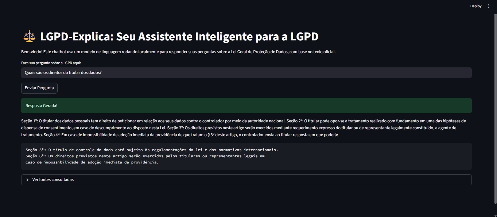

# ⚖️ LGPD-Explica: Seu Assistente Inteligente para a LGPD


Um chatbot inteligente que utiliza um modelo de linguagem para responder perguntas sobre a Lei Geral de Proteção de Dados (LGPD) do Brasil, com base no texto oficial da lei.

---


## 📖 Sobre o Projeto

A Lei Geral de Proteção de Dados (LGPD) é uma legislação extensa e complexa, cujo entendimento é crucial para empresas, desenvolvedores e cidadãos. No entanto, encontrar respostas específicas em seus artigos pode ser uma tarefa demorada e desafiadora.

O **LGPD-Explica** foi criado para resolver este problema. Utilizando uma arquitetura de **Geração Aumentada por Recuperação (RAG)**, este projeto transforma o denso documento da lei em uma base de conhecimento interativa. O sistema permite que o usuário faça perguntas em linguagem natural e receba respostas coesas e contextualizadas, geradas por um modelo de linguagem de ponta (`TinyLlama-1.1B-Chat`) rodando inteiramente na máquina local, garantindo privacidade e controle total dos dados.

## ✨ Funcionalidades Principais

* **Consultas em Linguagem Natural:** Faça perguntas complexas sobre a LGPD como se estivesse conversando com um especialista.
* **Respostas Baseadas em Fontes:** Todas as respostas são construídas a partir de trechos relevantes extraídos diretamente do texto da lei, evitando "alucinações" do modelo.
* **Visualização das Fontes:** Expanda a seção "Ver fontes consultadas" para auditar os trechos exatos da lei que a IA usou para formular a resposta.
* **Arquitetura 100% Local:** O modelo de linguagem roda localmente, o que significa que nenhuma das suas perguntas ou dados é enviado para APIs de terceiros.

## 🛠️ Tecnologias Utilizadas

Este projeto foi construído com um stack moderno de IA e Python:

* **Frontend:** Streamlit
* **Orquestração de IA:** LangChain
* **Modelo de Linguagem (LLM):** TinyLlama/TinyLlama-1.1B-Chat-v1.0 (via Hugging Face Transformers)
* **Embeddings:** Sentence-Transformers (via Hugging Face)
* **Vector Store:** FAISS (Facebook AI Similarity Search)
* **Processamento de Documentos:** PyPDF
* **Bibliotecas Base:** PyTorch, Transformers, Accelerate

## 🚀 Como Executar Localmente

Siga os passos abaixo para ter o projeto rodando em sua máquina.

### Pré-requisitos

* Python 3.11+
* Git

### Passos de Instalação

1.  **Clone o repositório:**
    ```bash
    git clone [https://github.com/seu-usuario/lgpd-explica.git](https://github.com/seu-usuario/lgpd-explica.git)
    cd lgpd-explica
    ```

2.  **Crie e ative um ambiente virtual:**
    ```bash
    # Windows
    python -m venv .venv
    .\.venv\Scripts\activate

    # macOS / Linux
    source .venv/bin/activate
    ```

3.  **Instale as dependências:**
    ```bash
    pip install -r requirements.txt
    ```

4.  **Prepare a Base de Conhecimento:**
    * Baixe o texto da LGPD em formato PDF do [site oficial do Planalto](http://www.planalto.gov.br/ccivil_03/_ato2015-2018/2018/lei/l13709.htm).
    * Salve o arquivo com o nome `lgpd.pdf` dentro da pasta `data/`.

5.  **Execute a Aplicação:**
    ```bash
    streamlit run app.py
    ```

> **Aviso:** A primeira vez que você fizer uma pergunta, a biblioteca `transformers` irá baixar o modelo TinyLlama (cerca de 2.2 GB) e carregá-lo na memória. **Este processo pode levar de 2 a 5 minutos** e pode consumir uma quantidade significativa de RAM. Por favor, seja paciente. As consultas seguintes serão mais rápidas.

## 🔮 Próximos Passos e Melhorias

Este projeto serve como uma base robusta para diversas evoluções futuras:

* **🚀 Otimização de Performance e Escalabilidade:**
    * Substituir o modelo local por uma versão mais poderosa e rápida servida via API (como a API da Mistral, OpenAI ou Google Gemini). Isso reduziria drasticamente o tempo de resposta e o consumo de recursos locais, tornando a aplicação mais escalável.

* **🎨 Melhorias na Interface (UI/UX):**
    * Implementar um histórico de conversas para que o usuário possa ver suas perguntas anteriores.
    * Melhorar a visualização das fontes, talvez destacando no PDF original os trechos utilizados.

* **📚 Base de Conhecimento Expansível:**
    * Adicionar uma funcionalidade de upload para que o usuário possa "ensinar" o chatbot com outros documentos legais, pareceres ou artigos.

* **📊 Avaliação de Qualidade (QA):**
    * Implementar um framework de avaliação de RAG (como RAGAs) para medir objetivamente a precisão do retriever e a qualidade das respostas geradas.

---
